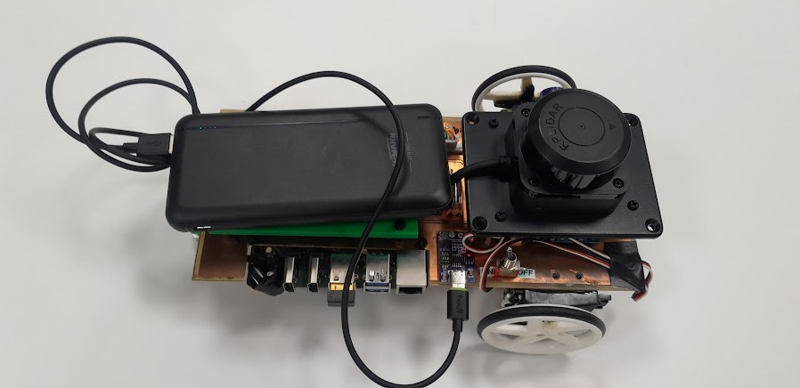

# The Delta Bot

## What is the Delta Bot?
The Delta Bot is an open-source DIY robot AI platform that uses Radxa's single board computer, the [Rock 5B](https://radxa.com/products/rock5/5b/), and Parallax's [Continuous Rotation Servo Motors](https://www.parallax.com/product/parallax-continuous-rotation-servo-factory-centered/).

Optionally you can add the C1 LIDAR to the robot: https://github.com/berndporr/c1lidar and of course any compatible camera.

<p align="center">
  
  
</p>

## Hardware

### Schematics
- For the list of components used refer to [BOM.md](BOM.md).
- For details on the DeltaBot schematic, pcb, and footprint library refer to [PCB.md](PCB.md).

### Additional Mechanical Parts
Additional Mechanical Parts were designed in CAD and can be accessed [here](additional_files/deltabot.f3z).
These were used to secure the external components onto the Single PCB Chassis:
<p align="center">
  
  
  
</p>

## Software

### Install ARMbian

Download from
https://www.armbian.com/rock-5b/
the image "Armbian 25.8.2 Bookworm Minimal / IOT".

Call `armbian-config` and upgrade to Debian "trixie".

### Enabling PWM drivers and UART in armbianEnv.txt

Start `sudo nano /boot/armbianEnv.txt`, identify these lines and add/edit them that
they look like these:

```
console=display
overlay_prefix=
overlays=rk3588-pwm14-m0 rk3588-pwm8-m0 rk3588-uart2-m0
```

This enables the UART and PWM on the pins 33 and 34 on the 40 pin header.

### Change permissions for PWM

Create the group `gpio`:

```
groupadd gpio
```
and add yourself and other users to it who want to write to the PWM device.

Copy the file [90-gpio.rules](90-gpio.rules) to `/etc/udev/rules.d/`. This will
make sure that the PWM can accessed by any user who's in the gpio group.

## Credits
- Saleh AlMulla - 2721704A@student.gla.ac.uk
- Bernd Porr -  bernd.porr@glasgow.ac.uk
- Yixuan Zha - 2974642Z@student.gla.ac.uk
