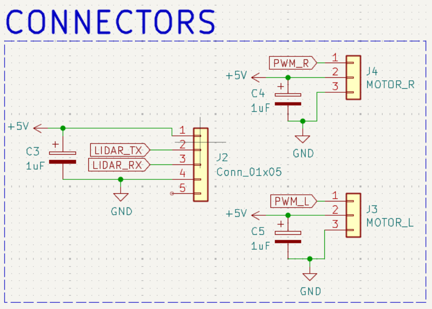
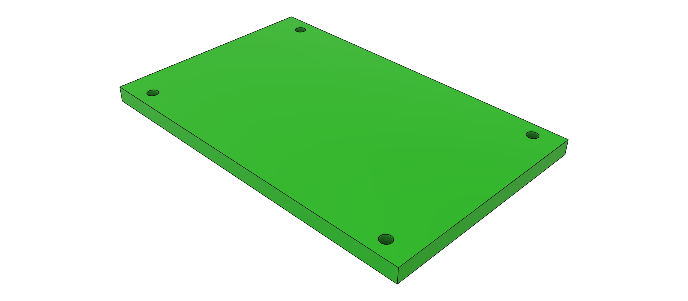

# The Delta Bot

## What is the Delta Bot?
The Delta Bot is an open-source DIY robot AI platform that uses Radxa's single board computer, 

 - the [Rock 5B+](https://radxa.com/products/rock5/5b/),
 - Parallax's [Continuous Rotation Servo Motors](https://www.parallax.com/product/parallax-continuous-rotation-servo-factory-centered/),
 - C1 LIDAR https://github.com/berndporr/c1lidar and
 - Raspberry PI V2 camera

<p align="center">
  
  
</p>

## Hardware

### Schematics
For details on the DeltaBot schematic, pcb, and footprint library refer to the subfolder [schematic_files](schematic_files).

### Connectors



Plug the right motor into J4, the left motor into J3 and the LIDAR into J2.

### Additional Mechanical Parts
Additional Mechanical Parts were designed in CAD and can be accessed [here](additional_files/deltabot.f3z):
<p align="center">
  
</p>
In particular the "stage" which holds the power bank.

## Software

### Install ARMbian

Download from
https://www.armbian.com/rock-5b/
the image "Armbian 25.8.2 Bookworm Minimal / IOT".
the 
Call `armbian-config`:
  - upgrade to Debian "trixie"
  - Make sure you have kernel 26.2.1 Armbian Linux vendor headers 6.1.115-vendor-rk35xx

### PWM motor drivers

Start `sudo nano /boot/armbianEnv.txt`, identify these lines and add/edit them that
they look like these:

```
console=display
overlay_prefix=
overlays=rk3588-pwm14-m0 rk3588-pwm8-m0
```

This enables the UART and PWM on the pins 33 and 34 on the 40 pin header.

Create the group `gpio`:

```
groupadd gpio
```
and add yourself and other users to it who want to write to the PWM device.

Copy the file [90-gpio.rules](90-gpio.rules) to `/etc/udev/rules.d/`. This will
make sure that the PWM can accessed by any user who's in the gpio group.

The library and example programs how to control the motors are in [wheeleddrive](wheeleddrive).

### LIDAR

Enable the UART for serial communication. Start `sudo nano /boot/armbianEnv.txt`, identify these lines and add `rk3588-uart2-m0` to overlays.

```
overlay_prefix=
overlays=rk3588-uart2-m0
```

Add yourself to the group `dialout` to access /dev/tty*.

Plug the LIDAR into the LIDAR connector on the robot PCB.

The driver and example programs are here: https://github.com/berndporr/c1lidar

### Raspberry PI V2 Cameras

The 1st RPI V2 camera has already a device overlay (`rock-5b-rpi-camera-v2`). The device overlay for the 2nd camera
needs to be compiled from source:

```
cpp -nostdinc -I /usr/src/linux-headers-6.1.115-vendor-rk35xx/include/ -undef -x assembler-with-cpp rock-5b-plus-cam1-rpi-camera-v2.dts > cam1.dts
dtc -@ -I dts -O dtb -o /tmp/rock-5b-plus-cam1-rpi-camera-v2.dtbo cam1.dts
cp /tmp/rock-5b-plus-cam1-rpi-camera-v2.dtbo /boot/dtb-6.1.115-vendor-rk35xx/rockchip/overlay/
```

Add this to the overlays in `armbianEnv.tex`:
```
overlays=rk3588-pwm14-m0 rk3588-pwm8-m0 rk3588-uart2-m0 rock-5b-rpi-camera-v2 rock-5b-plus-cam1-rpi-camera-v2
```

and reboot.

If all goes well both cameras will show up as:

```
media-ctl -p -d 0

rkcif (platform:rkcif-mipi-lvds2):
	/dev/video0
	/dev/video1
...
	/dev/media0

rkcif (platform:rkcif-mipi-lvds4):
	/dev/video11
	/dev/video12
...
	/dev/video21
	/dev/media1
```

which are the raw devices outputting Bayer patterns. The media device 1 is for the 2nd camera raw processing chain.

The media devices 2 and 3 are the Image Signal Processing chains which decode the images into YUV or Grey images.

To config the cameras you you need to config the V4L subdevices:

```
v4l2-ctl --device=/dev/v4l-subdev2 -L
v4l2-ctl --device=/dev/v4l-subdev7 -L

User Controls

                       exposure 0x00980911 (int)    : min=0 max=4095 step=1 default=1575 value=1575
                           gain 0x00980913 (int)    : min=256 max=43663 step=1 default=256 value=21960
                horizontal_flip 0x00980914 (bool)   : default=0 value=1
                  vertical_flip 0x00980915 (bool)   : default=0 value=1
```

[See the demo dual camera viewer](opencv-camera-callback) how it's all done in C++!


## Credits
- Saleh AlMulla - 2721704A@student.gla.ac.uk
- Bernd Porr -  bernd.porr@glasgow.ac.uk
- Yixuan Zha - 2974642Z@student.gla.ac.uk
