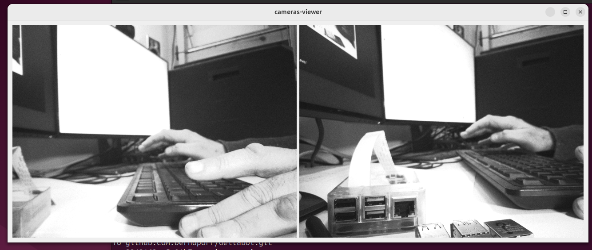
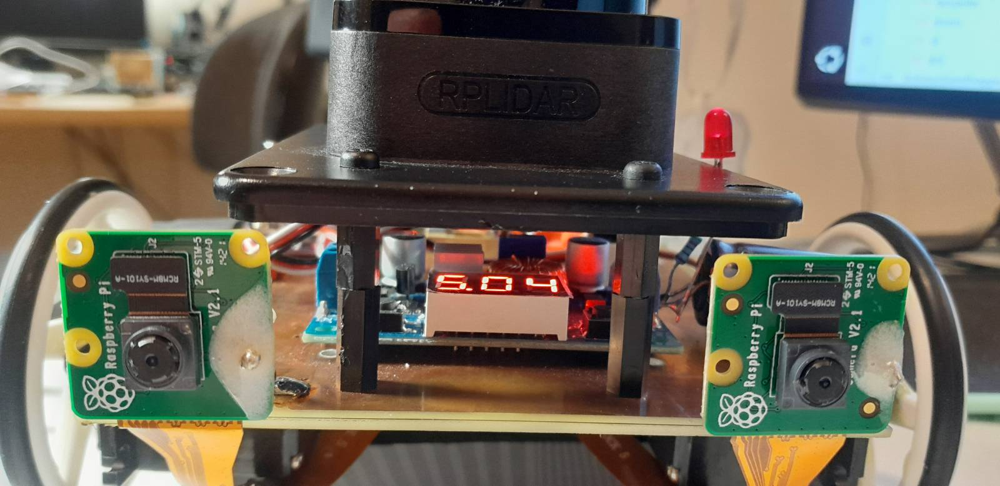

# Dual camera viewer




## Required packages

```
sudo apt install libopencv-dev
sudo apt-get install qt6-base-dev
```

## Demo program

```
cmake .
make
./cameras-viewer
```

Note that the only FourCC image formats which work on the Rock5 are GREY and NV12 for
B&W and colour respectively.

## Further reading

See https://github.com/berndporr/opencv-camera-callback for in depth discussion about
V4L and its media pipelines.
